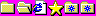

# w9

I used to use K-Meleon, until I didn't.

Some of these icons are original. Some of these were stolen from elsewhere. I didn't keep track. I wish I did. Someone help me find out.

<!--
--> <!--
--> <!--
--> <!--
--> <!--
--> <!--
--> <!--
--> <!--
--> <!--
--> <!--
--> <!--
--> <!--
--> <!--
--> <!--
--> <!--
--> <!--
--> <!--
--> 
